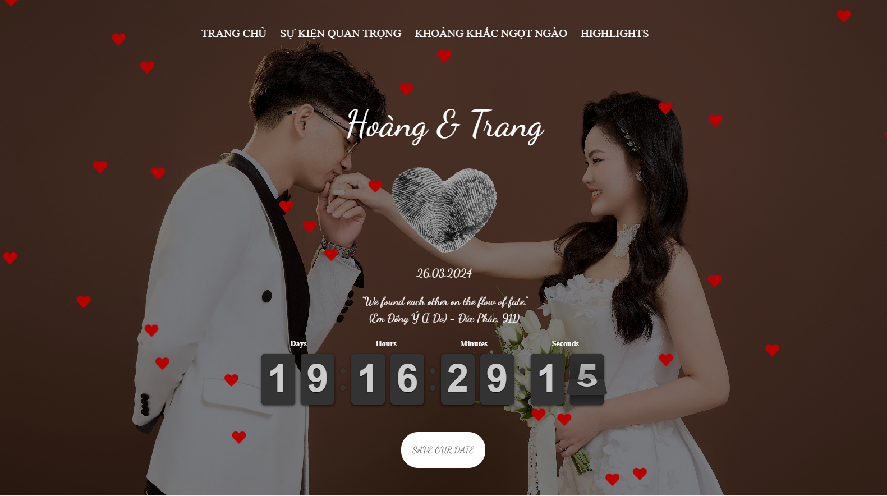

Source code for our wedding website 👫 (https://github.com/shyamjos/wedding-website) ,source tool connect: https://github.com/levinunnink/html-form-to-google-sheet, Based on HTML theme https://freehtml5.co/wedding-free-html5-bootstrap-template-for-wedding-websites

To set the countdown date see below section in `js/clock.js`

```
  // Target future date/24 hour time/Timezone
  let targetDate = moment.tz("2023-10-29 12:00", "Asia/Kolkata");
```

## Sreenshot


